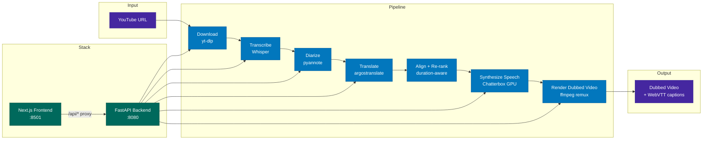

# Foreign Whispers — YouTube Dubbing Pipeline

**Author:** Naman Singh  
**Project:** Foreign Whispers — AI, ML, NLP dubbing pipeline integration  
**Primary stack:** FastAPI, Next.js, Docker Compose, Whisper STT, Argos Translate, Chatterbox TTS, pyannote.audio, ffmpeg

Foreign Whispers is an end-to-end YouTube dubbing pipeline that downloads a source video, extracts/transcribes speech, translates the transcript, generates time-aligned target-language speech, performs speaker diarization and speaker-aware voice selection, and stitches the final dubbed audio back into the original video without re-encoding the video stream.

> **Final Pipeline data and generated artifacts:** [Google Drive — pipeline_data artifacts](https://drive.google.com/drive/folders/1sVT8J8ndlbTjClMGxVPRBHdKivSr1GM0?usp=sharing)

- This folder includes the original downloaded YouTube video, YouTube captions, Whisper transcriptions, Argos translations, diarization outputs, TTS WAV audio files, final dubbed MP4 files, and generated VTT captions.
- This folder also includes screenshots and screen recordings that demonstrate the system workflow and provide proof of completion.

> **Note for reviewers**

- `pipeline_data/` in this GitHub repository contains intermediate audio, video, caption, transcription, translation, TTS, and final stitching artifacts generated across website runs, notebooks, debugging, experiments, and quality comparisons. Large media files such as `.mp4` and `.wav` outputs are also excluded from GitHub.
- Therefore, `pipeline_data/` in this repository should not be treated as the primary grading source; please use the committed notebooks, source code and the linked Google Drive folder for grading and verification.
- For detailed implementation steps, verification outputs, pipeline flow, experiments, and task-wise evidence, please refer to the executed notebooks in the `notebooks/` directory.


---
## Notes

Before executing the project, create the following two files in the root directory:

### `cookies.txt`

Export this file in Netscape format using a browser extension such as **Get cookies.txt LOCALLY**. This is required for authenticated YouTube downloads when needed.

### `.env`

Create a `.env` file with your Hugging Face token:

```env
FW_HF_TOKEN=your_hugging_face_token
```


### Additional execution notes

- The final aligned config used during notebook verification was `c-86ab861`; the baseline config was `c-fb1074a`.
- TTS generation is cached by config folder and video title. Re-running with the same config reuses existing WAV files unless the cache folder is deleted.
- The final MP4 is created by replacing the audio stream only; the original video stream is copied without re-encoding.

---


## Project Summary

The project implements a complete dubbing workflow:

1. **Download** a YouTube video and available captions using `yt-dlp`.
2. **Transcribe** speech using Whisper/faster-whisper.
3. **Translate** the transcript using Argos Translate.
4. **Diarize** speakers using pyannote and merge speaker labels into transcription/translation segments.
5. **Align** target-language TTS timing with the original source segments.
6. **Generate TTS** using Chatterbox, with optional speaker-specific reference voices.
7. **Stitch** the final dubbed audio into the original MP4 using ffmpeg audio remuxing, preserving the original video stream.
8. **Generate WebVTT captions** for the dubbed output.

---

[](./LICENSE)

YouTube video dubbing pipeline — transcribe, translate, and dub 60 Minutes interviews into a target language.

## Architecture



The system is a Dockerized FastAPI + Next.js pipeline. The API orchestrates downloading, transcription, diarization, translation, alignment, TTS generation, and final ffmpeg stitching. GPU-heavy work is delegated to dedicated Whisper and Chatterbox containers.

## Quick Start

Two profiles are available via Docker Compose:

```bash
# NVIDIA GPU — Whisper + Chatterbox on dedicated GPU containers
docker compose --profile nvidia up -d

# CPU only — no GPU containers (STT/TTS must be provided externally)
docker compose --profile cpu up -d
```

Open **http://localhost:8501** in your browser.

Useful checks:

```bash
# Confirm services are running
docker ps

# Follow API logs
docker logs -f foreign-whispers-api

# Follow TTS logs only
docker logs -f foreign-whispers-api | grep "\[tts\]"
```

## Pipeline Stages

| Stage | What it does | Output |
|-------|-------------|--------|
| **Download** | Fetch video + captions from YouTube via yt-dlp | `videos/`, `youtube_captions/` |
| **Transcribe** | Speech-to-text via Whisper | `transcriptions/whisper/` |
| **Diarize** | Run pyannote speaker diarization and assign speaker labels to transcript segments | `diarization/`, speaker fields in `transcriptions/whisper/*.json` |
| **Translate** | Source → target language via argostranslate (offline, OpenNMT) | `translations/argos/` |
| **Align / Re-rank** | Predict TTS duration, request shorter translations when needed, and compare greedy vs DP/beam alignment | alignment reports beside TTS outputs |
| **Synthesize Speech** | TTS via Chatterbox GPU or Coqui CPU fallback, time-aligned to original segments, with optional speaker-specific reference voices | `tts_audio/chatterbox/` |
| **Render Dubbed Video** | Replace audio track via ffmpeg remux; copy video stream without re-encoding | `dubbed_videos/` |
| **Captions** | Generate rolling two-line translated WebVTT captions | `dubbed_captions/` |

Captions are served as WebVTT via the `<track>` element — no subtitle burn-in:

| Endpoint | Source | Output |
|----------|--------|--------|
| `GET /api/captions/{id}/original` | YouTube captions (generated on the fly) | — |
| `GET /api/captions/{id}` | Translated segments + YouTube timing offset | `dubbed_captions/*.vtt` |

## Completed Notebook Work

This repository includes the completed integration notebooks for the Foreign Whispers project.

| Notebook | Area | Completion summary |
|----------|------|--------------------|
| Notebook 1 | Download integration | Verified download/caching behavior and source artifacts. |
| Notebook 2 | Transcription integration | Verified transcription outputs and Whisper artifact reuse. |
| Notebook 3 | Translation integration | Implemented duration-aware translation re-ranking support in `foreign_whispers/reranking.py`. |
| Notebook 4 | Diarization integration | Added `POST /api/diarize/{video_id}`, pyannote diarization caching, speaker merge into transcription JSON, frontend diarize stage, and per-speaker TTS groundwork. |
| Notebook 5 | Alignment integration | Improved TTS duration prediction, implemented re-ranking candidates, added DP/beam alignment optimizer, and built a multi-dimensional dubbing quality scorecard. |
| Notebook 6 | TTS integration | Implemented voice resolution fallback chain, exposed `speaker_wav` in the API, and verified per-speaker Chatterbox voice assignment. |
| Notebook 7 | Stitch integration | Verified final ffmpeg audio remux, generated aligned dubbed MP4, and produced VTT captions. |

## Implemented Features

- **Speaker diarization:** pyannote-based diarization with cached JSON output.
- **Speaker label merge:** transcription JSON segments are updated with `speaker` fields after diarization.
- **Frontend diarize stage:** the Next.js pipeline includes a Diarize stage between Transcribe and Translate.
- **Duration-aware translation re-ranking:** long translated segments can produce shorter Spanish candidates based on timing budgets.
- **Improved TTS duration prediction:** syllable/word/punctuation-based predictor replaces the crude character-rate heuristic.
- **DP/beam alignment optimizer:** `global_align_dp()` compares against the greedy scheduler and reduces cumulative drift in stress-test cases.
- **Dubbing quality scorecard:** timing accuracy, intelligibility proxy, semantic fidelity proxy, naturalness, and overall quality scoring.
- **Voice resolution:** speaker-specific, language-default, and global-default reference WAV fallback chain.
- **Speaker-aware TTS:** diarized speakers map to different Chatterbox reference WAVs when available.
- **Final stitch:** ffmpeg remux copies the original video stream and replaces only the audio stream.
- **WebVTT captions:** dubbed captions are generated alongside final MP4 outputs.

## Project Structure

```
foreign-whispers/
├── api/src/                     # FastAPI backend (layered architecture)
│   ├── main.py                  # App factory + lazy model loading
│   ├── core/config.py           # Pydantic settings (FW_ env prefix)
│   ├── routers/                 # Thin route handlers
│   │   ├── download.py          # POST /api/download
│   │   ├── transcribe.py        # POST /api/transcribe/{id}
│   │   ├── translate.py         # POST /api/translate/{id}
│   │   ├── diarize.py           # POST /api/diarize/{id}
│   │   ├── tts.py               # POST /api/tts/{id}
│   │   └── stitch.py            # POST /api/stitch/{id}, GET /api/video/*, /api/captions/*
│   ├── services/                # Business logic (HTTP-agnostic)
│   ├── schemas/                 # Pydantic request/response models
│   └── inference/               # ML model backend abstraction
├── foreign_whispers/            # Pure-Python library code used by notebooks and API
│   ├── alignment.py             # Duration metrics, greedy alignment, DP/beam optimizer
│   ├── diarization.py           # pyannote wrapper + assign_speakers()
│   ├── evaluation.py            # Clip report + dubbing quality scorecard
│   ├── reranking.py             # Duration-aware shorter translation candidates
│   └── voice_resolution.py      # Chatterbox speaker WAV fallback resolution
├── frontend/                    # Next.js + shadcn/ui
│   ├── src/components/          # Pipeline tracker, video player, result panels
│   ├── src/hooks/use-pipeline.ts # State machine for pipeline orchestration
│   └── src/lib/api.ts           # API client
├── notebooks/                   # Completed integration notebooks
│   ├── download_integration/
│   ├── transcription_integration/
│   ├── translation_integration/
│   ├── diarization_integration/
│   ├── alignment_integration/
│   ├── tts_integration/
│   └── stitch_integration/
├── download_video.py            # yt-dlp wrapper
├── transcribe.py                # Whisper wrapper
├── translate_en_to_es.py        # argostranslate wrapper
├── tts_es.py                    # Legacy Chatterbox client + time-aligned TTS generation
├── translated_output.py         # ffmpeg audio remux + legacy subtitle compositing
├── pipeline_data/               # All intermediate and output files (volume-mounted, not committed)
│   ├── speakers/                # Reference voice clips used by Chatterbox
│   └── api/
│       ├── videos/              # Downloaded source MP4s
│       ├── youtube_captions/    # Line-delimited JSON from yt-dlp
│       ├── transcriptions/
│       │   └── whisper/         # Whisper output JSON
│       ├── translations/
│       │   └── argos/           # argostranslate output JSON
│       ├── diarization/         # pyannote diarization JSON + extracted WAV
│       ├── tts_audio/
│       │   └── chatterbox/      # TTS WAV files per config
│       ├── dubbed_captions/     # Target-language VTT
│       └── dubbed_videos/       # Final dubbed MP4s per config
├── docker-compose.yml           # Profiles: nvidia, cpu, apple
├── Dockerfile                   # Multi-stage: cpu and gpu targets
└── docs/
    └── dubbing-alignment-design.md  # TTS temporal alignment literature survey + design
```

## API Endpoints

| Method | Endpoint | Description |
|--------|----------|-------------|
| POST | `/api/download` | Download YouTube video + captions |
| POST | `/api/transcribe/{id}` | Whisper speech-to-text |
| POST | `/api/translate/{id}` | Source → target language translation |
| POST | `/api/diarize/{id}` | Speaker diarization with pyannote and cache reuse |
| POST | `/api/tts/{id}` | Time-aligned TTS synthesis; supports `alignment` and `speaker_wav` query parameters |
| POST | `/api/stitch/{id}` | Audio remux (ffmpeg `-c:v copy`) |
| GET | `/api/video/{id}` | Stream dubbed video (range requests) |
| GET | `/api/video/{id}/original` | Stream original video (range requests) |
| GET | `/api/captions/{id}` | Translated WebVTT captions |
| GET | `/api/captions/{id}/original` | Original English WebVTT captions |
| GET | `/api/audio/{id}` | TTS audio (WAV) |
| GET | `/healthz` | Health check |

Example TTS calls:

```bash
# Baseline or aligned TTS depending on config and alignment flag
curl -X POST "http://localhost:8080/api/tts/GYQ5yGV_-Oc?config=c-86ab861&alignment=true"

# Explicit single reference voice for all segments
curl -X POST "http://localhost:8080/api/tts/GYQ5yGV_-Oc?config=c-86ab861&alignment=true&speaker_wav=es/default.wav"
```

## Artifact Bundle

The generated media and intermediate pipeline artifacts are not committed to GitHub because they include large video/audio files. They are provided separately in Google Drive:

**Google Drive:** [pipeline data, final outputs, screenshots, and screen recordings](PASTE_GOOGLE_DRIVE_LINK_HERE)

The artifact folder includes:

- original downloaded YouTube MP4
- YouTube caption JSON/text
- Whisper transcription JSON
- Argos translation JSON
- pyannote diarization JSON and extracted diarization WAV
- speaker reference WAVs such as `SPEAKER_00.wav`, `SPEAKER_01.wav`, and `SPEAKER_02.wav`
- baseline and aligned Chatterbox TTS WAV files
- final dubbed MP4 files
- generated WebVTT caption files
- screenshots and screen recordings documenting frontend behavior, API logs, notebook outputs, and final proof of completion

## Development

### Container architecture

```
Host machine
├── foreign_whispers/      ← bind-mounted into API container
├── api/                   ← bind-mounted into API container
├── pipeline_data/api/     ← bind-mounted into API container
├── pipeline_data/speakers/← bind-mounted into TTS container as /app/voices
│
└── Docker Compose
    ├── foreign-whispers-stt   (GPU)  :8000  — Whisper inference
    ├── foreign-whispers-tts   (GPU)  :8020  — Chatterbox inference
    ├── foreign-whispers-api   (CPU)  :8080  — FastAPI orchestrator
    └── foreign-whispers-frontend      :8501  — Next.js UI
```

The API container is CPU-only — it delegates all GPU work to the STT and TTS
containers via HTTP. The `foreign_whispers/` library and `api/` source are
**bind-mounted** from the host, so edits on the host are immediately visible
inside the container.

The TTS container mounts `pipeline_data/speakers/` as `/app/voices`, allowing Chatterbox to use reference WAV files for speaker cloning.

### Editing and debugging the library

1. **Start all services:**

   ```bash
   docker compose --profile nvidia up -d
   ```

2. **Edit any file** in `foreign_whispers/` or `api/` on the host (e.g. in VS Code).

3. **Restart the API container** to pick up changes:

   ```bash
   docker compose --profile nvidia restart api
   ```

   To avoid manual restarts, add `--reload` to the uvicorn command in
   `docker-compose.yml`:

   ```yaml
   command: ["uv", "run", "uvicorn", "api.src.main:app", "--host", "0.0.0.0", "--port", "8080", "--reload"]
   ```

   With `--reload`, uvicorn watches for file changes and restarts automatically.

4. **Test via the SDK** from a notebook or Python REPL on the host:

   ```python
   from foreign_whispers import FWClient
   fw = FWClient()             # connects to http://localhost:8080
   fw.transcribe("GYQ5yGV_-Oc")
   ```

5. **Test the library directly** (no Docker needed for pure-Python alignment work):

   ```python
   from foreign_whispers import global_align, compute_segment_metrics, clip_evaluation_report
   ```

   This is the two-phase workflow:
   - **Phase 1 (SDK):** Call `FWClient` methods to drive the pipeline through Docker (download, transcribe, translate, diarize, TTS, stitch). Data lands in `pipeline_data/api/`.
   - **Phase 2 (library):** Import `foreign_whispers` directly to iterate on alignment algorithms using data produced in Phase 1. No GPU or Docker needed.

### Local setup (no Docker)

```bash
uv sync                    # install all dependencies
uv run python -c "from foreign_whispers import FWClient; print('ok')"
```

For Jupyter/VS Code notebooks, register the kernel once:

```bash
uv pip install ipykernel
uv run python -m ipykernel install --user --name foreign-whispers
```

Then select the **foreign-whispers** kernel in VS Code's kernel picker.

### When to rebuild

| Change | Action needed |
|--------|--------------|
| Edit `foreign_whispers/*.py` or `api/**/*.py` | Restart API container (or use `--reload`) |
| Edit `pyproject.toml` / add dependencies | `docker compose --profile nvidia build api && docker compose --profile nvidia up -d api` |
| Edit `frontend/` | Frontend has its own hot-reload; no action needed |
| Edit `docker-compose.yml` | `docker compose --profile nvidia up -d` (re-creates changed services) |

### File ownership

The API container runs as your host UID/GID (set in `.env`), so all files it
creates in `pipeline_data/` are owned by you — not root. If you see permission
errors on existing files, they were created by an older root-mode container:

```bash
sudo chown -R $(id -u):$(id -g) pipeline_data/
```

### Frontend

```bash
cd frontend && pnpm install && pnpm dev
```

### Requirements

- Python 3.11
- ffmpeg (system-wide)
- deno (for yt-dlp YouTube extraction)
- Docker + Docker Compose
- NVIDIA GPU recommended for Whisper + Chatterbox inference
- Hugging Face token required for pyannote diarization (`FW_HF_TOKEN`)

### Hugging Face model access

For pyannote speaker diarization to work, the Hugging Face account used for `FW_HF_TOKEN` must have access to the required gated pyannote models.

Before running diarization, log in to Hugging Face in your browser and accept the user conditions for:

- `pyannote/speaker-diarization-3.1`
- `pyannote/segmentation-3.0`

Then create a Hugging Face access token and place it in `.env`:

```env
FW_HF_TOKEN=your_hugging_face_token
```

## Verification Commands

```bash
# Syntax checks for edited Python files
python -m py_compile \
  foreign_whispers/diarization.py \
  foreign_whispers/reranking.py \
  foreign_whispers/alignment.py \
  foreign_whispers/evaluation.py \
  foreign_whispers/voice_resolution.py \
  api/src/routers/diarize.py \
  api/src/routers/tts.py \
  api/src/services/tts_service.py \
  api/src/services/tts_engine.py

# Confirm final stitched outputs
find pipeline_data/api/dubbed_videos -name "*.mp4"
find pipeline_data/api/dubbed_captions -name "*.vtt"

# Confirm speaker-specific TTS logs
docker logs --tail=300 foreign-whispers-api | grep "\[tts\]"
```


## Useful Commands

```bash
docker compose --profile nvidia up -d --build
```


Check running containers:

```bash
docker ps
```

View API logs:

```bash
docker logs -f foreign-whispers-api
```

View only TTS logs:

```bash
docker logs --tail=300 foreign-whispers-api | grep "\[tts\]"
```

Stop services:

```bash
docker compose --profile nvidia down --remove-orphans
```